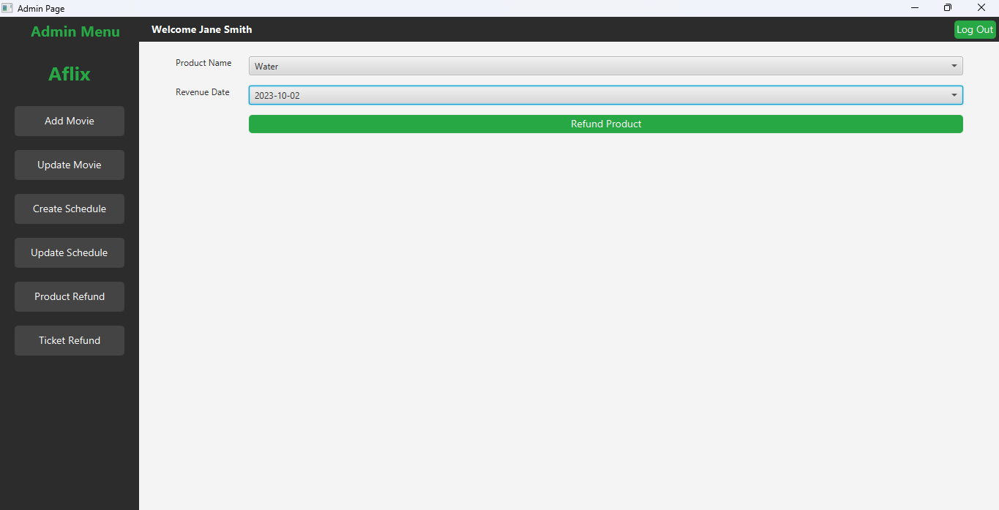

# Cinema Center Management System

A comprehensive cinema management application built with **Java**, **JavaFX**, and **MySQL**. This system provides role-based access control for three types of users: Admin, Manager, and Cashier, each with specific functionalities to manage cinema operations efficiently.

## 🎬 Project Overview

The Cinema Center Management System is designed to streamline cinema operations by providing dedicated interfaces for different user roles. The system manages movies, schedules, seats, products, customers, and transactions through an intuitive JavaFX interface.

## 🚀 Features

### 🔐 Role-Based Access Control
- **Admin**: Complete system control
- **Manager**: Business operations and analytics  
- **Cashier**: Customer service and transactions

### 🎭 Core Functionalities
- **Movie Management**: Add, update, and delete movies
- **Schedule Management**: Create and manage movie sessions
- **Seat Reservation**: Real-time seat booking system
- **Product Sales**: Snacks, beverages, and merchandise
- **Invoice Generation**: Automated billing and receipts
- **Revenue Tracking**: Financial analytics and reporting

## 🛠 Technology Stack

| Technology | Purpose |
|------------|---------|
| **Java** | Core application logic |
| **JavaFX** | User interface framework |
| **MySQL** | Database management |
| **Maven** | Project management and dependencies |
| **CSS** | UI styling and theming |

## 📁 Project Structure

```
cinema-center-management/
├── src/main/java/com/example/cinamacentermanagement/
│   ├── controllers/          # JavaFX Controllers
│   ├── dao/                 # Data Access Objects
│   ├── database/            # Database connection and SQL scripts
│   ├── model/               # Entity classes
│   └── Main.java           # Application entry point
├── src/main/resources/
│   └── com/example/cinamacentermanagement/
│       ├── css/            # Stylesheets
│       ├── fxml/           # FXML layout files
│       └── icons/          # UI icons
├── images/                 # Application screenshots
└── pom.xml                # Maven configuration
```

## 🗄️ Database Schema

The system uses a MySQL database with the following key tables:

- **Movies**: Store movie information and pricing
- **Halls**: Cinema hall details and capacity
- **Sessions**: Movie screening schedules
- **Seats**: Seat arrangement and availability
- **Customers**: Customer information
- **Employees**: User accounts with role-based access
- **Products**: Snacks, beverages, and merchandise
- **ShoppingCart**: Shopping cart functionality
- **Invoices**: Transaction records
- **Revenue**: Financial tracking

## 👨‍💼 Admin Interface

Administrators have full system control with comprehensive management capabilities.

<div align="center">

### Admin Dashboard


### Movie Management
<div style="display: flex; justify-content: space-between;">
  
  
</div>

### Schedule Management
<div style="display: flex; justify-content: space-between;">
  
  
</div>

### Refund Management
<div style="display: flex; justify-content: space-between;">
  
  
</div>

</div>

## 💰 Cashier Interface

Cashiers handle customer transactions and ticket sales efficiently.

<div align="center">

### Cashier Workflow
<div style="display: grid; grid-template-columns: 1fr 1fr; gap: 10px;">
  
  
  
  
</div>

### Product Sales


</div>

## 👔 Manager Interface

Managers oversee business operations with access to analytics and inventory management.

<div align="center">

### Manager Dashboard


### Business Operations
<div style="display: grid; grid-template-columns: 1fr 1fr; gap: 10px;">
  
  
  
  
</div>

</div>

## ⚙️ Installation & Setup

### Prerequisites
- **Java JDK 11** or higher
- **MySQL Server 8.0** or higher
- **Maven 3.6** or higher
- **JavaFX SDK** (if not included in JDK)

### Database Setup

1. **Create Database:**
   ```sql
   CREATE DATABASE Cinema_Center_Management;
   ```

2. **Run Table Creation Script:**
   ```bash
   mysql -u your_username -p Cinema_Center_Management < src/main/java/com/example/cinamacentermanagement/database/SQL/table.sql
   ```

3. **Insert Sample Data:**
   ```bash
   mysql -u your_username -p Cinema_Center_Management < src/main/java/com/example/cinamacentermanagement/database/SQL/insert_random.sql
   ```

### Application Setup

1. **Clone the Repository:**
   ```bash
   git clone [repository-url]
   cd cinema-center-management
   ```

2. **Configure Database Connection:**
   Update database credentials in `DatabaseConnection.java`:
   ```java
   private static final String URL = "jdbc:mysql://localhost:3306/Cinema_Center_Management";
   private static final String USER = "your_username";
   private static final String PASSWORD = "your_password";
   ```

3. **Build and Run:**
   ```bash
   mvn clean compile
   mvn javafx:run
   ```

## 🔑 Default User Accounts

| Role | Username | Password |
|------|----------|----------|
| Manager | manager[XXXX] | password123 |
| Admin | admin[XXXX] | password123 |
| Cashier | cashier[XXXX] | password123 |

*Note: XXXX represents random 4-digit numbers generated during data insertion*

## 🎯 Key Features Breakdown

### 🎬 Movie Management
- Add new movies with posters and details
- Update existing movie information
- Set dynamic pricing for different movies
- Genre categorization and summaries

### 📅 Schedule Management
- Create movie sessions across multiple halls
- Real-time seat availability tracking
- Flexible time slot management
- Hall capacity optimization

### 🛒 Point of Sale System
- Shopping cart functionality
- Multiple product categories (Snacks, Beverages, Toys)
- Age-based discount system
- Tax calculation and invoice generation

### 📊 Analytics & Reporting
- Revenue tracking and analysis
- Inventory management
- User activity monitoring
- Financial reporting tools

## 🔧 Technical Implementation

### Architecture Patterns
- **MVC (Model-View-Controller)**: Clean separation of concerns
- **DAO Pattern**: Database abstraction layer
- **Singleton Pattern**: Database connection management

### Key Components

1. **Controllers**: Handle user interactions and business logic
2. **Models**: Represent data entities and business objects
3. **DAOs**: Manage database operations
4. **FXML**: Define user interface layouts
5. **CSS**: Style and theme the application

## 🚀 Future Enhancements

- [ ] Online booking system
- [ ] Email notification system
- [ ] Mobile application
- [ ] Advanced reporting dashboard
- [ ] Customer loyalty program
- [ ] Integration with payment gateways

## 🤝 Contributing

This project was developed as a final assignment for the Java Object-Oriented Programming course. Contributions and suggestions are welcome!

## 📝 License

This project is developed for educational purposes as part of a university coursework.

## 👨‍💻 Developer

**Toprak Kamburoğlu**
- 📧 Email: toprakkamburoglu@gmail.com
- 🎓 Student at Kadir Has University - Computer Engineering
- 📱 Phone: 0535 068 89 01

---

*This Cinema Center Management System demonstrates practical application of Java programming concepts, database design, and user interface development in a real-world scenario.*
